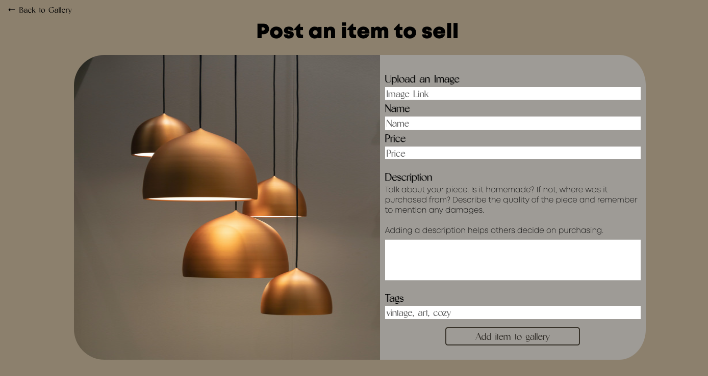

# Intelligent Design

#### A full-stack CRUD application.
<!--  -->
 

## Description
Int Design (Intelligent Design) is an community-powered, interior-design focused online marketplace. 

## Table of Contents
* [Technologies Used](#technologiesused)
* [Features](#features)
* [Design](#design)
* [Future Features](#nextsteps)
* [Deployed App](#deployment)
* [Works Cited](#workcited)
* [About the Author](#author)

## Technologies Used
* JavaScript
* CSS3
* Node.js
* EJS
* Express
* MongoDB
* Mongoose

## Features
Users can view items a gallery of items.  
Users can see extra details of each item on their own page.  
Users can create and post their own items to be viewed in the gallery. 
Form an items show page, users can edit the items information, save it to a favorites page, or delete the item from the gallery.

## Design
##### Add items to the gallery

##### Item details page

## Future Features
Incorporate search function and hyperlink tags to filter through gallery items.  
Users can purchase item posted to the gallery.  
Cart view with checkout form. Integrated merchant services.

## Deployed Link
Home Page:

Repository: [Github.com](https://github.com/casy1996/Int-Design)
  
    
## Works Cited:
Referencing between models:
- [Referencing another schema in mongoose](https://github.com/rohan-paul/Awesome-JavaScript-Interviews/blob/master/MongoDB/referencing-another-schema-in-Mongoose-2.md)
- [Reference ObjectId from another collection](https://www.mongodb.com/community/forums/t/how-to-reference-the-objectid-from-one-collection-schema-to-another/203108) 
- [Populate method](https://mongoosejs.com/docs/populate.html)

## About the Author:
Up and coming full-stack software developer with a passion for design and all things visual.
